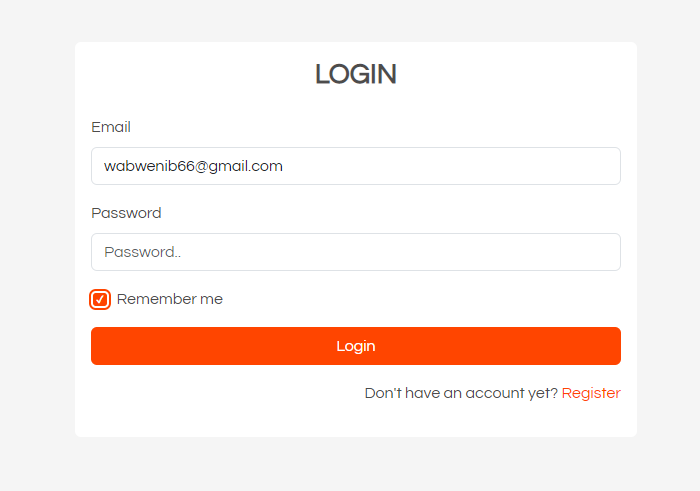

# THIS IS A SIMPLE LOGIN SYSTEM

This is a simple login system with remember me functionality. It's built in three versions.

- 1.  The bad version - Bad code and alot of repetition and logic is mixed with the user interface code.
- 2.  The good version - Good code with minimal code repetition and seperation of concerns. We separate the logic from the user interface.
- 3.  The better version - Better code, MVC pattern, OOP custom routes. Separate logic into custom classes and function.

### Note: The only best version may be achieved using one of the modern php frameworks like Laravel, Symphony, CodeIgniter, etc.

